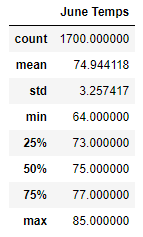
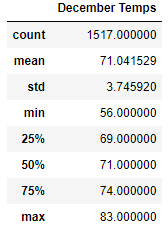
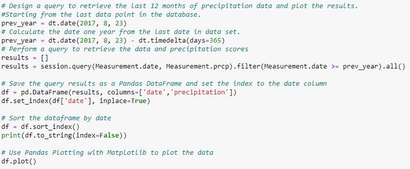

# Surfs Up Module 9 Challenge

## Overview of the Analysis

### Purpose
For this project we're serving as an analyst for W. Avy to help him figure out if it makes sense to open up a surf and ice cream shop in Oahu. For the challenge we will be looking at June and December to determine if it is sustainable to have the shop open year-round. 

## Results
Below, I will list out some differences in weather for June and December and see if it makes sense for W. Avy to open the shop year round. 

The first weather analysis we ran was for June. I filtered the session query to extract the month we were looking for - June. Once we filtered it, we got the necessary information on temperatures including the mean, the min, and the max.  The mean temperature was about 75 degrees and the coldest it got was 64. 

 

Next we looked at December and performed the same analysis. Filtered the session query for month 12, December, this time. We did see the min temperature get down to 56 degrees, but overall the mean was still similar to June. It came in at 71 degrees. 

* Key Differences
    
    * The average temperature had a difference of about 4 degrees. 75 in June vs. 71 in December. 
    * The minimum temperatures had a slightly larger variance. The low for June was 64 degrees vs. a low temperature of 56 for December. 
    * The max temperature for June was 85 degrees vs. the max temperature in December of 83. 

## Summary and Further Analysis

Based on the findings above I do feel like the weather is appropriate and can sustain a year-round surf shop and ice cream shop.

The average temperatures are similar, although it does get a bit colder from time to time in December. People may not weant ice cream when it is 56 degrees out. The good news, though, is that we did see a high of 83 in December as well. So there will defintely be opportunities for people to go out and get ice cream, even in December. 

Something we could look into for additional analysis could be precipitation using the measeruements from the SQLite file and filtering for precipitation. We did something like this in the module, but we would then filter for month to provide additional analysis on June vs. December weather. 

Another thing we may be able to look at for weather data is wind. Wind may be good for surfing, but poor conditions for ice cream. We would have to communicate with some of the locals, ask W. Avy, or do some research to see when surfing is most popular during the year. Wind may ultimately be a pro, not a con, because it would drive people to the business for surf equpiment. 